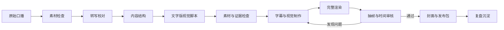

# Talking-Head Video Workflow

把一段普通口播，制作成有字幕、有重点动效、有证据意识、经过抽帧审核的知识视频。

这个仓库是一套可安装的 Codex Skill。它把口播视频制作拆成可执行、可检查、可复用的生产流程，让不同创作者只需要提供自己的口播素材，也能稳定获得清晰、克制、专业的成片结构。

## 它能做什么

给 Codex 一段口播视频或音频后，这个 Skill 会指导智能体依次完成：

1. 检查视频比例、时长、帧率和音频
2. 转写并校对字幕、数字、产品名和专业词
3. 识别开场钩子、章节、数据、对比、步骤和结论
4. 先写文字版视觉脚本，再开始制作
5. 区分真实证据、普通素材和 AI 生成画面
6. 制作字幕、关键词、数据卡、对比卡和选择性 B-roll
7. 渲染完整草稿并提取关键帧
8. 检查遮脸、字幕重叠、动效密度和时间对齐
9. 输出最终视频、封面和发布文案
10. 把复盘结论沉淀成下一次可复用的改进

## 出来的效果

它追求的不是所有视频使用同一套皮肤，而是稳定复现同一套质量标准：

| 原始口播常见状态 | 使用 Skill 后 |
| --- | --- |
| 从头到尾只有人物和自动字幕 | 人物仍是主体，关键句才出现视觉强化 |
| 每句话都堆动效，画面很吵 | 一屏一个主视觉，普通解释段主动留白 |
| 大字、字幕和人物互相遮挡 | 根据人物位置划定安全区，保护脸和手势 |
| B-roll 与内容只是“看起来相关” | 素材必须对应具体语义，并标记证据或插画属性 |
| 截图、素材和 AI 画面混在一起 | 真实证据、普通插画、生成素材明确分级 |
| 渲染完成就直接发布 | 必须抽取钩子、转场、重点卡片和结尾帧进行审核 |
| 只交付一个 MP4 | 同时交付封面、视觉脚本、素材清单和发布包 |

默认视觉方向是深色基底、白色正文、蓝色结构信号和橙色冲突信号。已有品牌体系时，Skill 会优先沿用你的品牌，而不是强行覆盖。

## 适合什么视频

- AI 工具实测与知识口播
- 教程、经验分享和工作流拆解
- 产品评测、观点表达和案例复盘
- `9:16` 抖音、视频号、Reels、Shorts
- `16:9` B 站、YouTube 和课程型视频

不适合无人物混剪、剧情短片、音乐视频，或只需要文案而不需要制作的视频。

## 安装

### 方法一：让 Codex 安装

把下面这句话发送给 Codex：

```text
请使用 skill-installer 安装这个 Skill：
https://github.com/shitoudaidi/talking-head-video-workflow
```

安装完成后，在下一轮对话中调用它。

### 方法二：手动安装

macOS / Linux：

```bash
git clone https://github.com/shitoudaidi/talking-head-video-workflow.git \
  ~/.codex/skills/talking-head-video-workflow
```

Windows PowerShell：

```powershell
git clone https://github.com/shitoudaidi/talking-head-video-workflow.git `
  "$env:USERPROFILE\.codex\skills\talking-head-video-workflow"
```

安装后重新开始一轮 Codex 对话，让 Skill 出现在新的上下文中。

## 怎么用

准备一段已经录好的口播视频，然后把文件路径和下面的提示词交给 Codex：

```text
使用 $talking-head-video-workflow，把这段口播制作成完整知识视频：

素材：D:/video/raw-talking-head.mp4
平台：抖音
比例：9:16
字幕：中文主字幕，英文小字幕

先给我文字版视觉脚本和素材需求，再开始渲染。
最终必须检查关键帧，并交付视频、封面和发布文案。
```

如果不确定比例、字幕或视觉风格，也可以只提供素材：

```text
使用 $talking-head-video-workflow 处理这段口播。
请根据原视频判断比例和安全区，缺少真实证据时不要伪造。
```

## 输入什么

最低输入只需要一项：

- 一段人物口播视频，或包含完整口播的音频

提供以下内容时，结果会更稳定：

- 发布平台与目标比例
- 品牌颜色、字体、Logo
- 需要作为证据展示的真实截图或录屏
- 专有名词、数字和产品名称
- 希望保留或避免的剪辑风格

## 最终会得到什么

一次完整交付通常包括：

- 最终渲染视频
- 使用本地确定性文字排版的封面
- 带时间戳的转写稿
- 文字版视觉脚本
- 素材与证据清单
- 抽帧图或 contact sheet
- 审核与修改记录
- 标题、简介、话题、核心结论和可选置顶评论
- 本次制作复盘

## 工作流



Skill 不允许从口播直接跳到最终渲染。文字版视觉脚本是强制中间产物。

## 仓库里包含什么

| 路径 | 用途 |
| --- | --- |
| [`SKILL.md`](SKILL.md) | 智能体必须执行的完整生产流程和硬性规则 |
| [`references/visual-system.md`](references/visual-system.md) | 字幕、动效、颜色、安全区、B-roll 和横竖屏规范 |
| [`references/delivery-contract.md`](references/delivery-contract.md) | 渲染前门槛、抽帧方法和最终验收标准 |
| [`scripts/init_video_project.py`](scripts/init_video_project.py) | 初始化每条视频的标准工作目录和中间产物 |
| [`scripts/validate_visual_script.py`](scripts/validate_visual_script.py) | 检查时间轴、强调密度、双主视觉和证据缺失 |
| [`assets/visual-script.example.json`](assets/visual-script.example.json) | 可直接参考的视觉脚本数据格式 |
| [`agents/openai.yaml`](agents/openai.yaml) | Codex 中的 Skill 名称、简介和默认调用提示词 |

## 可选：手动初始化项目

Skill 自带的初始化脚本只依赖 Python 3：

```bash
python scripts/init_video_project.py ./my-video \
  --source ./inputs/talking-head.mp4 \
  --ratio 9:16
```

它会生成：

```text
my-video/
├── brief.md
├── transcript.json
├── visual-script.json
├── asset-manifest.json
├── review.md
├── publish-package.md
├── postmortem.md
├── inputs/
├── assets/
├── renders/
└── review/
```

视觉脚本完成后可以独立校验：

```bash
python scripts/validate_visual_script.py ./my-video/visual-script.json
```

## 核心质量规则

- 一屏只允许一个主视觉
- 不遮挡人物眼睛、鼻子、嘴和关键手势
- 字幕是理解层，不是第二套大标题系统
- 动效只服务钩子、数字、对比、步骤、证据和结论
- 普通口播段必须允许画面呼吸
- 库存素材和 AI 生成画面不能伪装成真实证据
- 模型生成的中文封面文字不能作为最终稿
- 没有抽帧检查的渲染不能称为完成

## 运行环境

Skill 本身不绑定某一个剪辑软件。Codex 会优先使用目标项目已有的技术栈。

推荐环境：

- Codex
- Python 3，用于初始化和视觉脚本校验
- FFmpeg，用于媒体检查、格式转换和抽帧
- Remotion 或现有剪辑工程，用于时间轴驱动的视频制作
- 可用的转写工具，用于生成句子级时间戳

它不是一个包含固定素材的“一键套模板”程序。它提供的是一套智能体可执行的生产标准、确定性检查工具和交付契约。

## License

[MIT](LICENSE)
