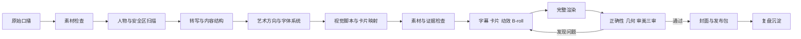

# Talking-Head Video Workflow

把一段普通口播，制作成有字幕、有重点动效、有证据意识、经过抽帧审核的知识视频。

这个仓库是一套可安装的 Codex Skill。它把我们在多轮真实视频生产、版本对比和逐帧复盘中形成的方法，整理成可执行的视觉设计与制作系统。不同创作者只需要提供自己的口播素材，也能复用同一套审美判断、字体层级、卡片语法、动效节奏和验收标准。

它不只是提醒 Codex “加字幕、加卡片”。它会要求智能体先扫描人物与负空间，再决定字体、构图、卡片类型和动效预算，最后通过完整渲染与审美评分才能交付。

## 它能做什么

给 Codex 一段口播视频或音频后，这个 Skill 会指导智能体依次完成：

1. 检查视频比例、时长、帧率和音频
2. 抽取 8-12 个源视频帧，扫描脸、嘴、麦克风、手势和稳定负空间
3. 转写并校对字幕、数字、产品名和专业词
4. 识别开场钩子、信任段、数据、对比、证明、判断和结论
5. 先确定艺术方向、字体层级、A 轨占比和反目标
6. 编写文字版视觉脚本与卡片映射表
7. 按句子功能选择指标卡、对比卡、流程卡、证明窗、选择卡或结论卡
8. 区分真实证据、普通素材和 AI 生成画面
9. 使用确定的弹簧、错峰和退出参数制作 Remotion 动效
10. 渲染完整草稿并提取关键帧
11. 分三轮检查正确性、几何可读性、审美与节奏
12. 输出最终视频、封面、发布文案和可复用复盘

## 出来的效果

它追求的不是所有视频使用同一套皮肤，而是稳定复现同一套质量标准：

| 原始口播常见状态 | 使用 Skill 后 |
| --- | --- |
| 从头到尾只有人物和自动字幕 | 人物仍是主体，关键句才出现视觉强化 |
| 每句话都堆动效，画面很吵 | 一屏一个主视觉，普通解释段主动留白 |
| 大字、字幕和人物互相遮挡 | 根据人物位置划定安全区，保护脸和手势 |
| B-roll 与内容只是“看起来相关” | 素材必须对应具体语义，并标记证据或插画属性 |
| 截图、素材和 AI 画面混在一起 | 真实证据、普通插画、生成素材明确分级 |
| 字号凭感觉，长句来了再缩小 | 先定义四级字体系统并测试最长真实字符串 |
| 所有内容都套同一种列表卡 | 根据数字、比较、流程、证明、选择和结论使用不同卡片语法 |
| 动效速度和方向每次都临时决定 | 使用统一弹簧、位移、错峰和退出参数，再按语义调整 |
| 只检查有没有遮挡 | 逐帧评分主次、字体、语义、平衡、一致性和证据诚实度 |
| 渲染完成就直接发布 | 必须抽取钩子、转场、重点卡片和结尾帧进行审核 |
| 只交付一个 MP4 | 同时交付封面、视觉脚本、素材清单和发布包 |

默认视觉方向是深色基底、白色正文、蓝色结构信号和橙色冲突信号。已有品牌体系时，Skill 会优先沿用你的品牌，而不是强行覆盖。

## 第二版视觉设计系统

### 审美审查

每个代表帧都会从七个维度按 `0-2` 分审核：

- 主视觉是否一秒可识别
- 人脸与手势是否安全
- 字体层级是否清楚
- 视觉是否真正解释了句子
- 画面平衡是否有意图
- 相邻镜头是否属于同一个视觉世界
- 证据是否诚实

任何一项出现 `0` 分，画面就必须重做。最终平均分目标不低于 `1.7`。

### 字体系统

在 `1920x1080` 基准画布上，默认使用四级视觉层级：

| 层级 | 用途 | 推荐字号 |
| --- | --- | ---: |
| L1 | 钩子、反转、最终判断 | 68-92px |
| L2 | 卡片标题、结构说明 | 38-52px |
| L3 | 关键词和当前节奏 | 30-42px |
| L4 | 标签、来源、序号 | 14-22px |

中文主字幕通常为 `34-42px`，双语副字幕为 `16-22px`。竖屏会按手机观看距离重新设定，而不是机械缩放横屏参数。

### 卡片语法

Skill 内置的是“句子功能到画面”的选择逻辑，而不是一套万能矩形：

- 巨型观点字：钩子、反转、结论
- 指标卡 / 账单卡：数字、成本、评分
- 双栏对比：预期与现实、前后变化
- 清单卡：三到四个共享同一问题的项目
- 流程条 / 管线：步骤、缓存、交付链路
- 中心对象图：机制和关系
- 真实证明窗：录屏、截图、指标
- 工具选择卡：按标准给出明确推荐
- Verdict 结论卡：一句判断加一个辅助对比

### 动效语法

30fps 下默认从下面的参数起步：

```text
spring: damping 18 / stiffness 160 / mass 0.8
entry: 6-12 帧
exit: 6-10 帧
位移: 18-38px
列表错峰: 每行 5-8 帧
```

普通强调通常保持 `1.0-2.8s`。快速 B-roll 为 `0.45-0.75s`，普通镜头为 `0.75-1.25s`，只有高价值锚点才接近 `1.6s`。

## 适合什么视频

- AI 工具实测与知识口播
- 教程、经验分享和工作流拆解
- 产品评测、观点表达和案例复盘
- `9:16` 抖音、视频号、Reels、Shorts
- `16:9` B 站、YouTube 和课程型视频

不适合无人物混剪、剧情短片、音乐视频，或只需要文案而不需要制作的视频。

## 安装

### 方法一：让 Codex 安装

把下面这句话发送给 Codex：

```text
请使用 skill-installer 安装这个 Skill：
https://github.com/shitoudaidi/talking-head-video-workflow
```

安装完成后，在下一轮对话中调用它。

### 方法二：手动安装

macOS / Linux：

```bash
git clone https://github.com/shitoudaidi/talking-head-video-workflow.git \
  ~/.codex/skills/talking-head-video-workflow
```

Windows PowerShell：

```powershell
git clone https://github.com/shitoudaidi/talking-head-video-workflow.git `
  "$env:USERPROFILE\.codex\skills\talking-head-video-workflow"
```

安装后重新开始一轮 Codex 对话，让 Skill 出现在新的上下文中。

## 怎么用

准备一段已经录好的口播视频，然后把文件路径和下面的提示词交给 Codex：

```text
使用 $talking-head-video-workflow，把这段口播制作成完整知识视频：

素材：D:/video/raw-talking-head.mp4
平台：抖音
比例：9:16
字幕：中文主字幕，英文小字幕

先给我文字版视觉脚本和素材需求，再开始渲染。
最终必须检查关键帧，并交付视频、封面和发布文案。
```

如果不确定比例、字幕或视觉风格，也可以只提供素材：

```text
使用 $talking-head-video-workflow 处理这段口播。
请根据原视频判断比例和安全区，缺少真实证据时不要伪造。
```

## 输入什么

最低输入只需要一项：

- 一段人物口播视频，或包含完整口播的音频

提供以下内容时，结果会更稳定：

- 发布平台与目标比例
- 品牌颜色、字体、Logo
- 需要作为证据展示的真实截图或录屏
- 专有名词、数字和产品名称
- 希望保留或避免的剪辑风格

## 最终会得到什么

一次完整交付通常包括：

- 最终渲染视频
- 使用本地确定性文字排版的封面
- 带时间戳的转写稿
- 人物、手势和负空间版面扫描
- 字体层级与最长字符串测试方案
- 文字版视觉脚本
- 卡片与动效映射表
- 素材与证据清单
- 抽帧图或 contact sheet
- 逐帧审美评分
- 审核与修改记录
- 标题、简介、话题、核心结论和可选置顶评论
- 本次制作复盘

## 工作流



Skill 不允许从口播直接跳到最终渲染。文字版视觉脚本是强制中间产物。

## 仓库里包含什么

| 路径 | 用途 |
| --- | --- |
| [`SKILL.md`](SKILL.md) | 智能体必须执行的完整生产流程和硬性规则 |
| [`references/visual-system.md`](references/visual-system.md) | 字幕、动效、颜色、安全区、B-roll 和横竖屏规范 |
| [`references/art-direction.md`](references/art-direction.md) | 视觉性格、信息层级、一致性和审美否决标准 |
| [`references/typography.md`](references/typography.md) | 中文字体、四级字号、双语字幕、卡片和封面字法 |
| [`references/motion-and-cards.md`](references/motion-and-cards.md) | 句子功能到卡片的映射，以及动效参数和时间规则 |
| [`references/composition-and-rhythm.md`](references/composition-and-rhythm.md) | 人物安全区、横竖屏构图、A/B 轨和 B-roll 呼吸节奏 |
| [`references/remotion-implementation.md`](references/remotion-implementation.md) | 数据、组件、动态文字、媒体和 Remotion 实现边界 |
| [`references/frame-review.md`](references/frame-review.md) | 正确性、几何、审美三轮审核和动态抽查 |
| [`references/cover-system.md`](references/cover-system.md) | 封面构图、中文排版、人物合成和生成背景边界 |
| [`references/production-lessons.md`](references/production-lessons.md) | LongCat、Reasonix、横屏呼吸布局等真实版本迭代教训 |
| [`references/delivery-contract.md`](references/delivery-contract.md) | 渲染前门槛、抽帧方法和最终验收标准 |
| [`assets/design-system.json`](assets/design-system.json) | 可由智能体直接读取的颜色、字号、形状、动效和密度令牌 |
| [`scripts/init_video_project.py`](scripts/init_video_project.py) | 初始化每条视频的标准工作目录和中间产物 |
| [`scripts/validate_visual_script.py`](scripts/validate_visual_script.py) | 检查时间轴、强调密度、双主视觉和证据缺失 |
| [`assets/visual-script.example.json`](assets/visual-script.example.json) | 可直接参考的视觉脚本数据格式 |
| [`agents/openai.yaml`](agents/openai.yaml) | Codex 中的 Skill 名称、简介和默认调用提示词 |

## 可选：手动初始化项目

Skill 自带的初始化脚本只依赖 Python 3：

```bash
python scripts/init_video_project.py ./my-video \
  --source ./inputs/talking-head.mp4 \
  --ratio 9:16
```

它会生成：

```text
my-video/
├── brief.md
├── transcript.json
├── layout-survey.json
├── typography-plan.json
├── visual-script.json
├── card-map.md
├── asset-manifest.json
├── aesthetic-review.json
├── review.md
├── publish-package.md
├── postmortem.md
├── inputs/
├── assets/
├── renders/
└── review/
```

视觉脚本完成后可以独立校验：

```bash
python scripts/validate_visual_script.py ./my-video/visual-script.json
```

## 核心质量规则

- 一屏只允许一个主视觉
- 不遮挡人物眼睛、鼻子、嘴和关键手势
- 字幕是理解层，不是第二套大标题系统
- 动效只服务钩子、数字、对比、步骤、证据和结论
- 普通口播段必须允许画面呼吸
- 库存素材和 AI 生成画面不能伪装成真实证据
- 模型生成的中文封面文字不能作为最终稿
- 没有抽帧检查的渲染不能称为完成

## 运行环境

Skill 本身不绑定某一个剪辑软件。Codex 会优先使用目标项目已有的技术栈。

推荐环境：

- Codex
- Python 3，用于初始化和视觉脚本校验
- FFmpeg，用于媒体检查、格式转换和抽帧
- Remotion 或现有剪辑工程，用于时间轴驱动的视频制作
- 可用的转写工具，用于生成句子级时间戳

它不是一个包含固定素材的“一键套模板”程序。它提供的是一套智能体可执行的生产标准、确定性检查工具和交付契约。

## License

[MIT](LICENSE)
